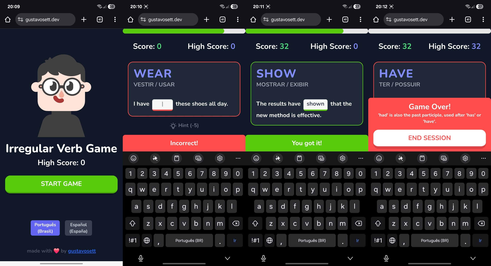

> ## I was searching for a simple game like duolingo to help me learn ONLY irregular verbs and I couldn't find one. So I decided to create my own.

A simple game like duolingo to help learn English irregular verbs through timed challenges.

Play live at [gustavosett.dev](https://gustavosett.dev)




## 🎯 How it Works

- Fill in the blanks with correct irregular verb forms (simple past or past participle)
- Race against the clock - correct answers add bonus time
- Use hints when stuck (but it costs points!)
- Track your high score with local storage

## 🚀 Quick Start

```bash
npm install
npm start
```

Open [http://localhost:3000](http://localhost:3000) to play.

## 🌍 Languages

Currently supports:
- Portuguese (Brazil)
- Spanish (add more in `public/languages/`)

## 🛠️ Built With

- React 19
- Tailwind CSS
- Create React App
